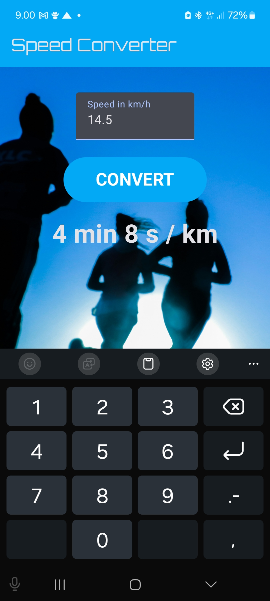

# **Speed Converter**

**Speed Converter** is an Android application that allows users to convert speeds from **kilometers per hour (km/h)** to **minutes per kilometer (min/km)**. The app is built using **Jetpack Compose** and follows modern Android development practices.

---

## ✨ Features
- 🚀 Convert speed from **km/h** to **min/km**
- 🎨 User-friendly interface with a background image
- ⌨️ Input field for entering speed
- 🔘 Button to trigger the conversion
- 📊 Displays the converted speed in minutes and seconds per kilometer
- 📌 Future update: **Support for multiple speed units (e.g., mph, m/s, ft/s, knots)**
- 📌 Future update: **Dropdown menu to select different conversion options**

---

## 📥 Installation
To use this application, clone the repository and open it in **Android Studio**:

```sh
git clone https://github.com/your-repo/speed-converter.git
cd speed-converter
```

Then, build and run the app on an **Android device or emulator**.

---

## 🔧 How It Works
1. **Enter** the speed in **km/h** in the provided text field.
2. **Tap** the **"CONVERT"** button.
3. The converted speed will be **displayed** in minutes and seconds per kilometer.

---

## 🛠️ Code Overview
### 📌 Main Components
- **SpeedConverterPage**: The main composable function that sets up the UI.
- **convertKmHToMinKm()**: Function to convert speed from **km/h** to **min/km**.
- **formatSpeedToMinutesAndSeconds()**: Formats the converted speed into a readable format.
- **MyFilledButton**: Custom composable button to trigger the conversion.

### 🚀 Key Technologies Used
- **Jetpack Compose**
- **Material 3 Components**
- **Kotlin Coroutines**
- **State Management** with `remember` and `mutableStateOf`

---

## 💡 Future Development Ideas
- 🔹 Create tests and handle edge cases
- 🔹 **Support for multiple speed units** (miles per hour, meters per second, feet per second, knots, etc.)
- 🔹 **Dropdown menus** for selecting the desired conversion units
- 🔹 **Real-time conversion** as the user types
- 🔹 **Dark mode support**
- 🔹 **Save recent conversions for quick access**

---

## 📸 Screenshots


---

## 📜 License
This project is licensed under the **MIT License**. See the LICENSE file for more details.

---

## 👤 Author
Developed by **[Your Name]** (or your GitHub/website link).

